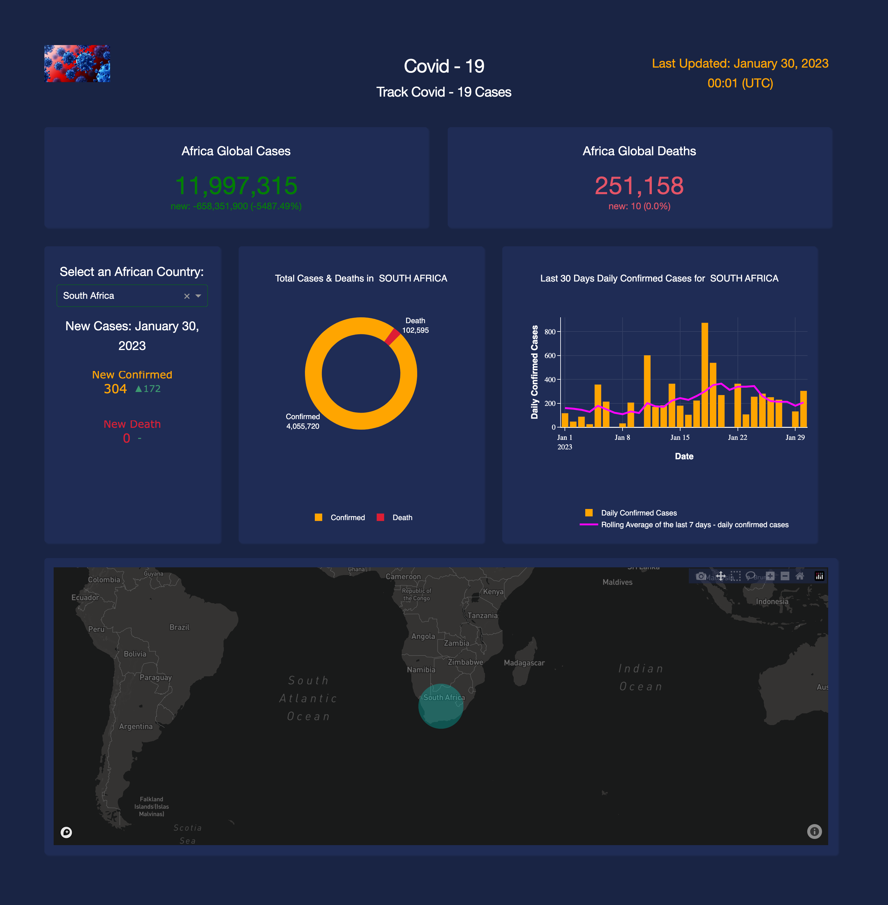

# AfricanCovidApp_DashRender

AfricanCovid is an automated Covid Tracker that is updated daily. The application was built with [Dash-Plotly](https://dash.plotly.com/) and deployed in free mode with [Render](https://render.com/). The data comes from [John Hopkins University](https://github.com/CSSEGISandData/COVID-19).  
The application can be viewed [here](https://command-geology-hall-jevf.onrender.com/)  

